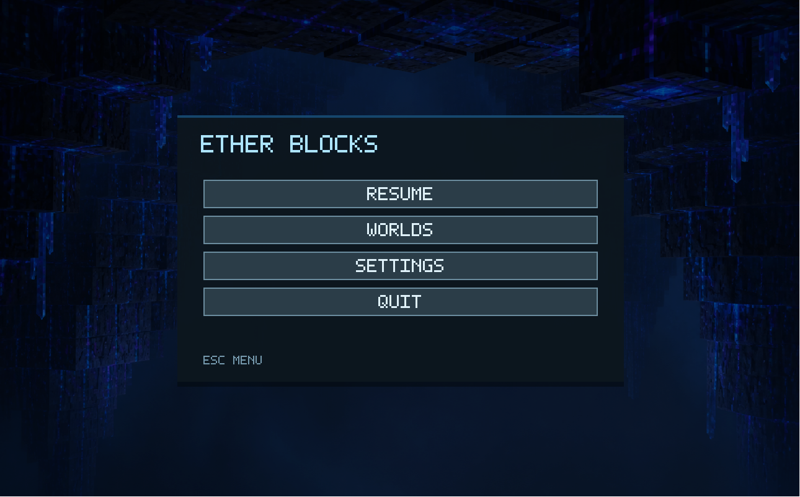

# Ether Blocks



**Ether Blocks** is a first-person voxel sandbox set inside a cold, crystalline void.
Mine, place, and shape glowing blocks while the world hangs in darkness around you.

This is not a Minecraft clone. The goal is a tighter atmospheric builder: minimal UI,
sharp block silhouettes, blue-black sci-fi lighting, and a world that feels like a
digital crystal cave suspended in empty space.

## Game Pitch

You wake in the ether with nothing but a crosshair, a handful of void materials, and
space to build. Every block is part of a floating lattice. Every edit changes the
shape of the structure around you.

- Explore a dark void world from a first-person view.
- Aim at blocks with voxel ray casting.
- Place new blocks against selected faces.
- Remove blocks to carve paths, rooms, bridges, and crystalline frames.
- Switch between five void materials: core, crystal, glass, bedrock, and stone.
- Save worlds and return to them through the in-game menu.

## Current Features

- First-person camera movement and mouse look.
- Real-time block selection with a center crosshair and selection outline.
- Block placement and removal.
- Chunked world mesh rebuilding after edits.
- Multiple block textures loaded from an asset manifest.
- World persistence with player camera state.
- Main menu with resume, world selection, new world, delete world, settings, and quit.
- Settings for video, fog, clear color, input, world size, and chunk size.
- OpenGL rendering foundation for meshes, textures, materials, UI, framebuffers, and window input.

## Controls

| Input | Action |
| --- | --- |
| `W`, `A`, `S`, `D` | Move |
| Mouse | Look around |
| Left mouse button | Place selected block |
| Right mouse button | Remove targeted block |
| `1` - `5` | Select block material |
| Mouse wheel | Adjust camera zoom |
| `Esc` | Open menu |
| `F9` | Reload world from disk |

## World Style

Ether Blocks is built around a specific mood:

- no normal skybox;
- no terrain horizon;
- no friendly grassland palette;
- floating structures in fog-heavy darkness;
- cyan-blue emissive surfaces;
- texture detail that reads like fractured void crystal.

The menu screenshot above shows the intended tone: quiet, sharp, cold, and slightly
hostile.

## Building

The project uses CMake and vcpkg manifest mode. It requires a C++23 compiler.

```sh
cmake -B ./build
cmake --build ./build --parallel
```

On Windows, the executable is generated at:

```text
build/app/app.exe
```

Run it from the repository root so relative asset paths resolve correctly.

## Roadmap

- Stronger in-game atmosphere: fog tuning, glow passes, and darker void composition.
- More game rules for block combinations and adjacent-material reactions.
- Energy propagation through connected structures.
- Animated or reactive block states.
- More world tools for faster building and editing.
- Better packaging so the game can be launched without a developer environment.

## Status

Ether Blocks is experimental and under active development. The current focus is
turning the prototype into a coherent playable sandbox while keeping the rendering
and world systems simple enough to evolve.
